# Advanced Lane Lines

The Jupyter notebook includes a lot of code I used for debugging purposes. The
final code is in:

 - `pipeline.py`: full processing from input image to final output
 - `funcs.py`: all functions used by pipeline and more
 - `utils.py`: couple of utility functions
 - `calibrate.py`: get calibration parameters for camera
 - `test.py`: code for visualization and video rendering

Both `pipeling.py` and `funcs.py` should not be imported since they require
some variables to be in the global namespace. This was done so that I could
easily change the functions and the pipeline and see the differences in the
notebook by executing the text read fromt he files.

`test.py` expects video frames to be stored individually on a folder (path is
hard coded). It requires an argument to work:

 - `viz`: visualizes images one by one from a video;
 - `store`: makes a video out of the input video frames.

The write-up for my progress through this project is below.

## Camera Calibration

The code for this step is contained in the file `calibrate.py`.

I prepared the object points coorginates of the chessboards corners

The code for this step is contained in the first code cell of the IPython
notebook located in "./examples/example.ipynb" (or in lines # through # of the
file called `some_file.py`).  

I start by preparing "object points", which will be the (x, y, z) coordinates of
the chessboard corners in the world. Here I am assuming the chessboard is fixed
on the (x, y) plane at z=0, such that the object points are the same for each
calibration image.  Thus, `objp` is just a replicated array of coordinates,
and `objpoints` will be appended with a copy of it every time I successfully
detect all chessboard corners in a test image.  `imgpoints` will be appended
with the (x, y) pixel position of each of the corners in the image plane with
each successful chessboard detection.  

I then used the output `objpoints` and `imgpoints` to compute the camera
calibration and distortion coefficients using the `cv2.calibrateCamera()`
function. A example of an undistorted image can be seen below.

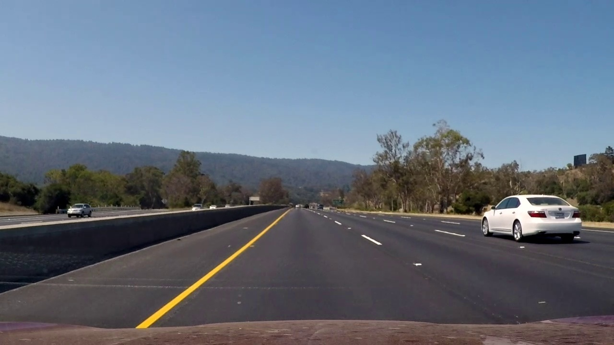

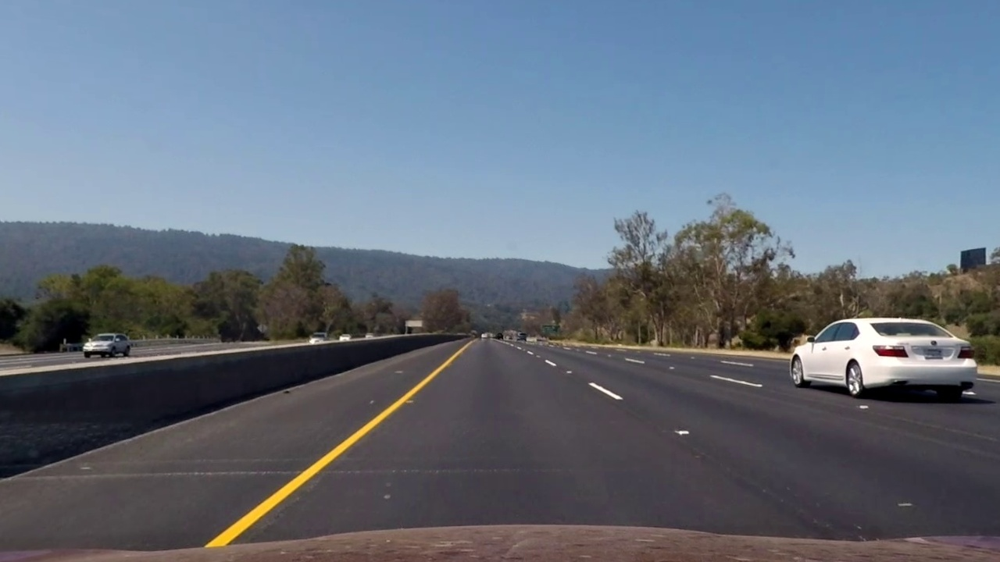

We can observe the effect of the transformation in the back of the white car on
the right and on the hood of the car itself.

## Pipeline
The code for the entire pipeline is in `pipeline.py`.

### Warping
The first step of the pipeline is, naturally, to correct the distortion of the
input image, which as been seen above.

The second step is to warp the image. This is important since it ensures that
the lane lines are parallel in the image. This transformation can be seen
below.

I went through some iterations on the source and destination points for the
warp transformation. While working on the project video, I used destination
points that would also serve the purpose of performing a region of interest
cut. However this implied a significant loss of information. While that was
not a problem on the project video, it was on the harder challenge video which
had very sharp turns whose pixels would be removed in this operation. For that
reason I changed the destination points to make sure all the necessary
information was there. This change had a small decrease in performance only in
2 or three frames in the project video. And here, this could be corrected by using a region of interest crop. These 2 warpings can be seen below.

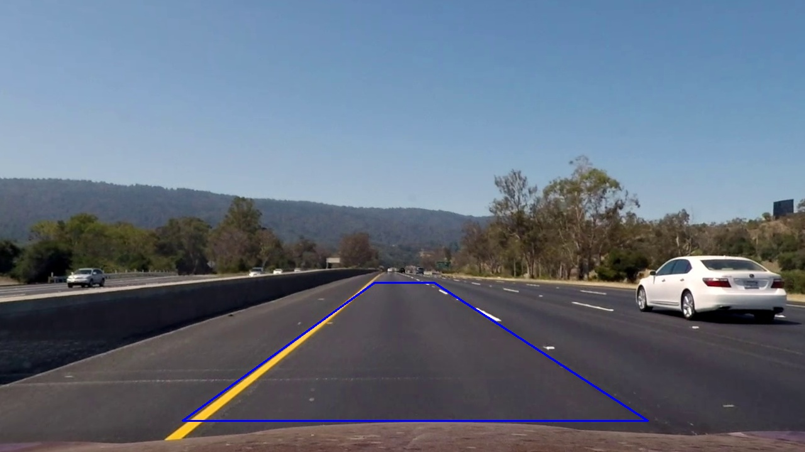

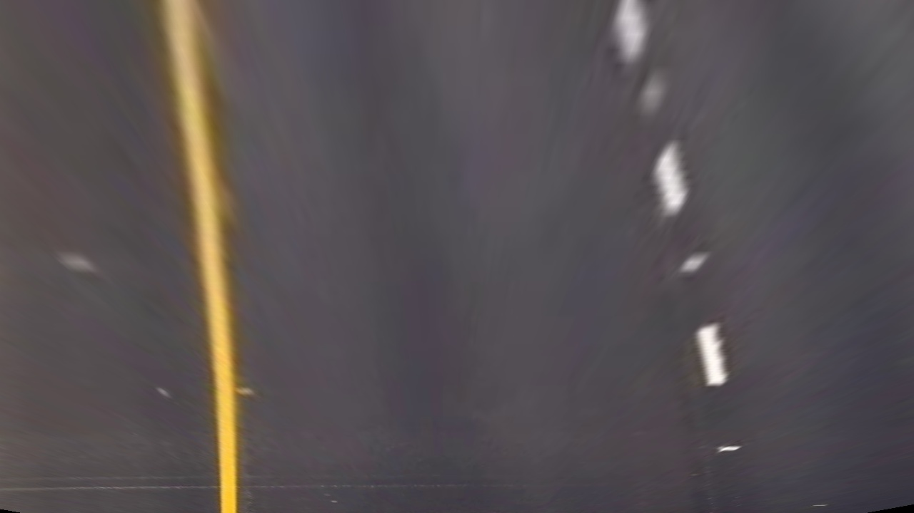

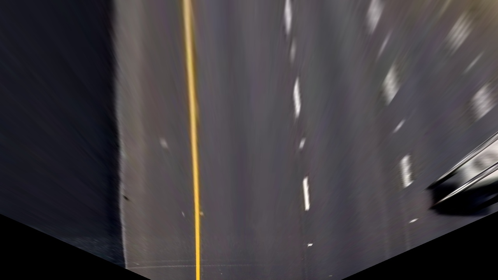

The definition of the source points is:
```python
h, w = 720, 1280
bot, top = h-50, 450  # bottom and top height
tl = 595  # top left x
bl = 290  # bot left x
tr = 690  # top right x
br = 1030  # bot right x

src_coords = np.float32([
            (bl, bot),  # bottom left vertex
            (br, bot),  # bottom right vertex
            (tr, top),  # top right vertex
            (tl, top)  # top left vertex
           ])
```

The destination points are defined as:
```python
margin = 500  # 300 for least information warping
dst_coords = np.array([(0+margin, h),
                (w-margin, h),
                (w-margin, 0),
                (0+margin, 0)], dtype=np.float32)
```

I checked that the final warping was a good fit by warping a straight road
image and making sure that I had a rectangle (seen below).

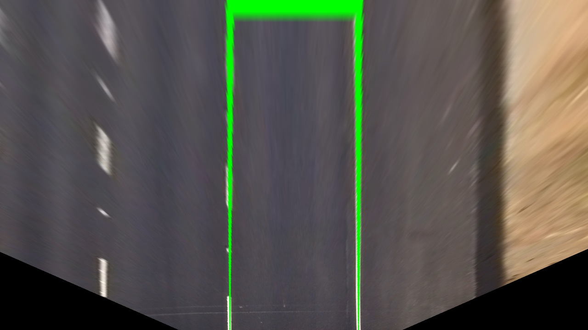

### Thresholding

This was the step where I spent most time trying different strategies. I
experimented with several color spaces (HSV, HLS, YUV, RGB). In the end I used
the saturation channel of HLS, the red channel of RGB and the result of the
Sobel operator on the x axis of the grayscale version of the image.
I used a simple script to rapidly and interactively find the parameters for these thresholdings. Both the parameters of these transformations and their
outputs can be seen below.

| Paramter   | Sobel x | Saturation | Red |
| --------   | ------- | ---------- | --- |
| Thresh min | 25      | 175        | 205 |
| Thresh max | 235     | 250        | 255 |

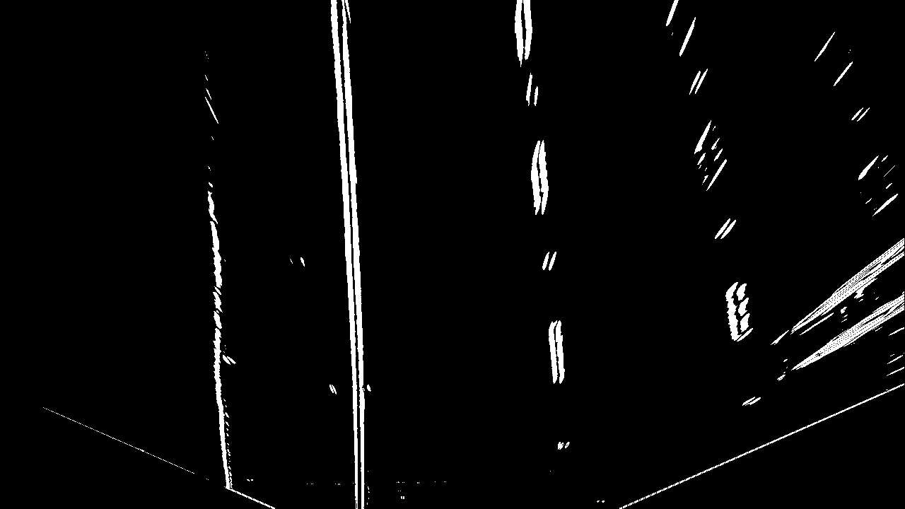

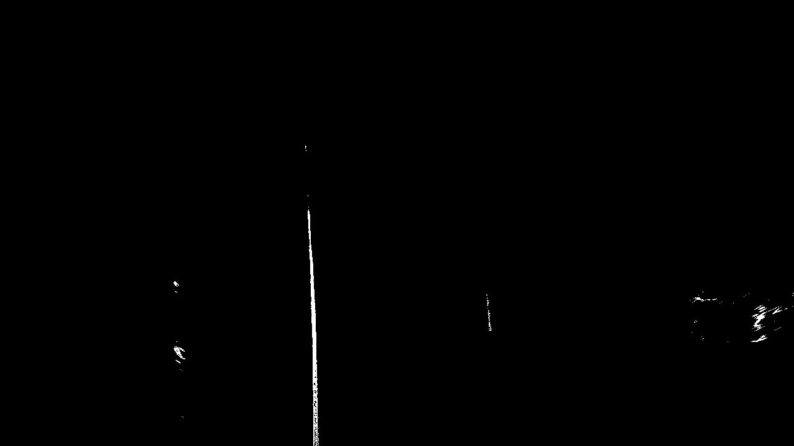

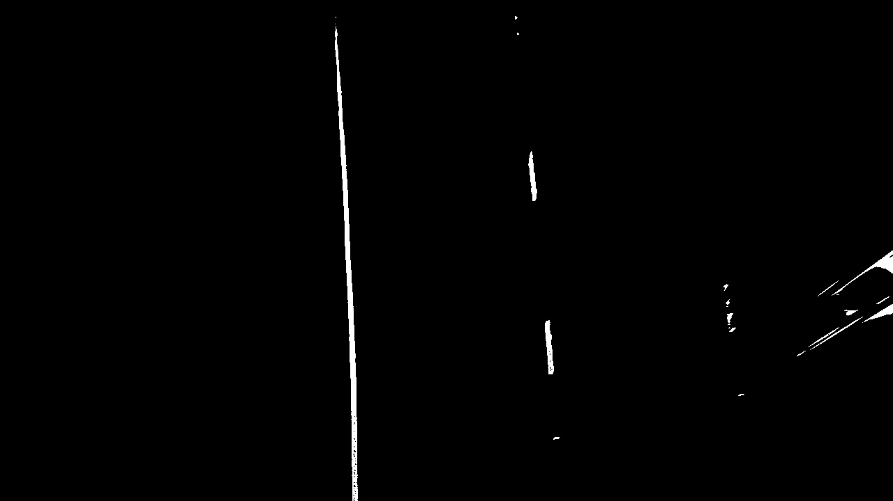

The 3 transformations are defined in `funcs.py` in the functions `abs_sobel_thresh`, `hls_select`, `bgr_threshold`. The first 2 functions were
taken from class. The final binary image was the result of an OR operation
between the output of the 3 transformations.

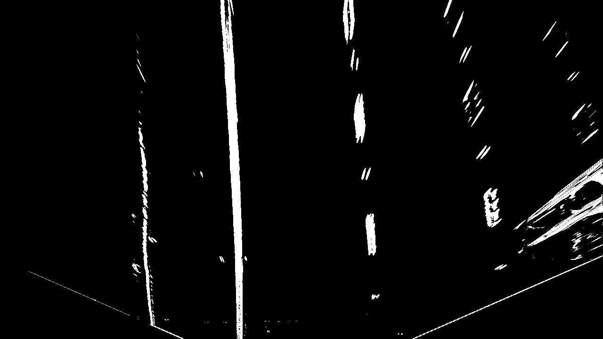

### Scanning for lane line pixels

For finding lane line pixels, I used the code from the class. It starts by
creating an histogram of binary image. The idea is that the peaks of the
histogram in the left and right halves of the image represent the x position of the lane lines. This strategy has its shortcomings. Firstly, the lane line pixel regions might not be dense. This
means that if the thresholding picks up a very dense pixel region that does not
belong to the lanes, the x position of the lane lines will be wrong. This is
clear in the harder challenge video. Another shortcoming is the case when the
curvature of the road is high and the histogram of the binary image will be
relatively constant throughout a large interval of the image. This will make it
impossible to pick up the start of the lane lines. Still, for the project video,
this strategy worked fine.

The peaks of the histogram are used as a starting point for the start of the
lane lines (from bottom to top). The height of the image is then divided in
several windows centered on the discovered peaks (I used 9 windows with a width
of 200 pixels - 100 for each side). As we go up on the image, the windows may
be recentered based on the pixels that reside in them.

An example of these windows can be seen below and the coloring of the points
belonging to the left and right lane lines.

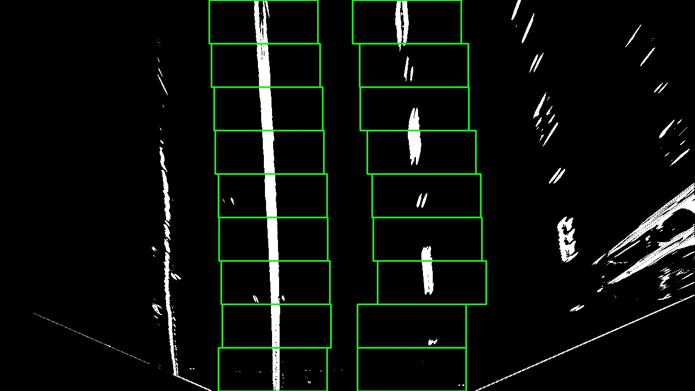

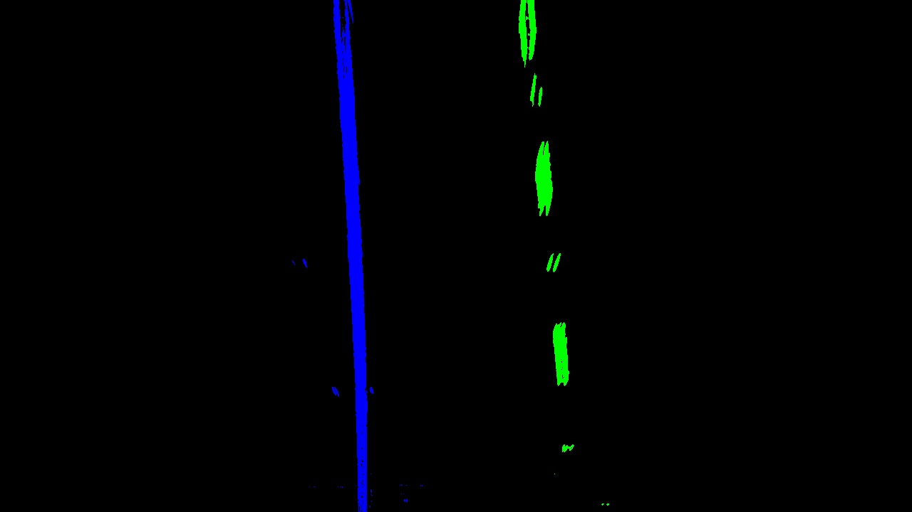

The function that obtains the pixels belonging to either side of the lane is
`get_points_for_fit_sliding_window` in `funcs.py`.

These points can also be obtained based on the polynomials from a previous
image. For each row of the image, an x is computed for each polynimal (left and
right). All pixels on that row withing a margin from the computed x are said to
be part of the lane line. I used a more restricted margin of 20 pixels in this
method.

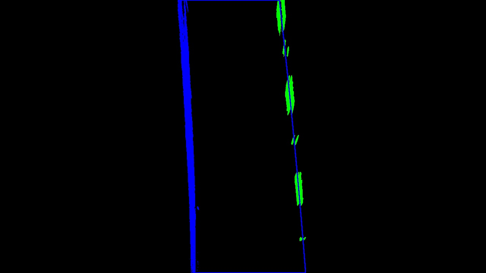

It's possible to see that due to the more restricted margin, less points are
included relative to the windows method. This method is defined in `funcs.py`
in the function `get_points_for_fit_from_polynomials`. This method greatly
increases the robustness of the lane lines' pixels scan. The reason for that is
that the difference between any two contiguous frames is very small so it
allows for a fine tuned scanning, being robust even when a lot of noise is
present.

Having obtained the pixels belonging to each side of the lane, 2 polynomials are
computed. The code for this is in the function `poly_from_points` in `funcs.py`.The figures below show the area between polynomials filled.

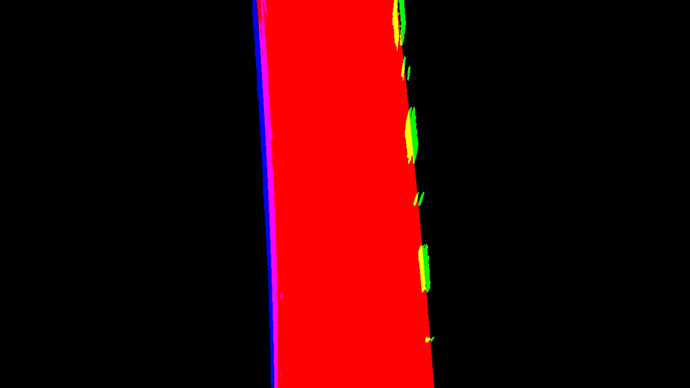

Afterwards, I just unwarp that area and overlay it with the original undistorted image.

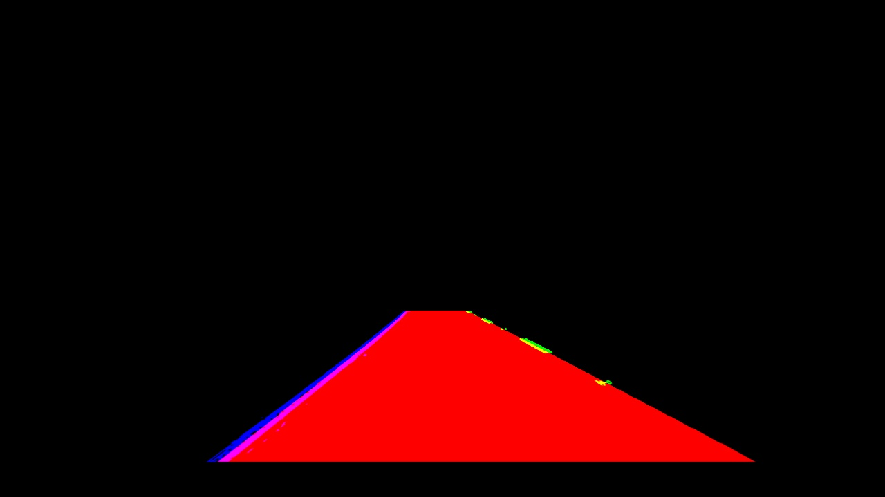

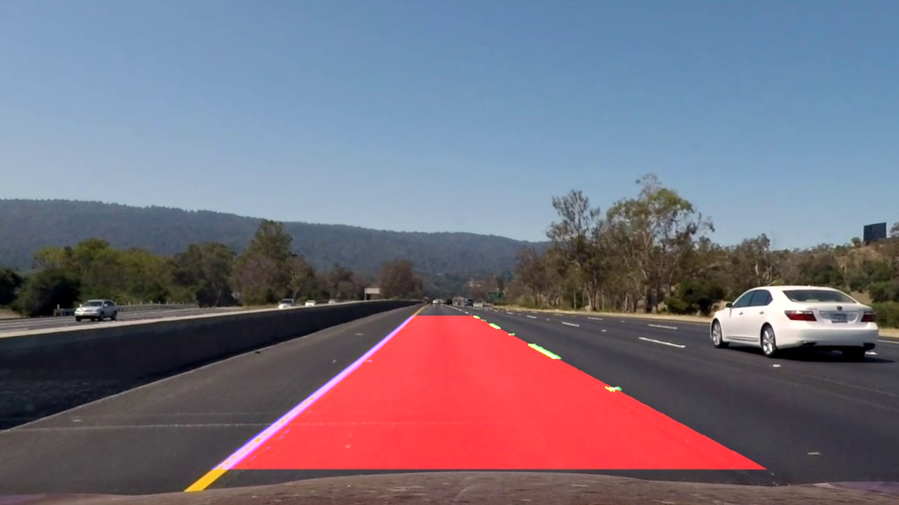

### Curvature radii and center offset
To compute the curvature radii and the center offset, I needed the real world
space coordinates of the pixels belonging to each side of the lane. I used the convertion values provided from class. In the y axis, the meter per pixel ratio
is 30 meters (aproximately distance from car to warp polygon top) divided by
the height of the image. In the x axis, the ratio is 3.7 meters (lane width) divided by 700 pixels.

With these ratios, it's possible to convert from pixel space to meter space.
I computed new polynomials using the converted left and right lane lines pixels.
The code for this is the same as before, but with a different argument.
I measured the curvature at the bottom of the image on both polynomials using
the formula (and code) from class. The code is in the function
`compute_curvature` in `funcs.py`.

For measuring the the center offset I first computed the middle points between
the bottom points on both polynomials and then subtracted image x center
(assuming camera is center mounted). The result was then converted to meter
space.

The final result of the pipeline can be seen below.

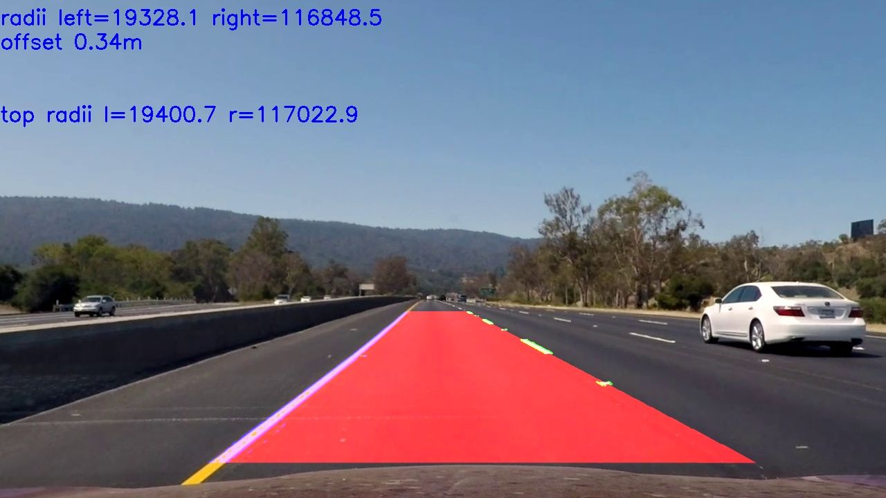

As expected, when the lane lines are very straight, the radii is very large.
Otherwise, the radii keep mostly between 600-3000.

## Video
I used OpenCV to produce a video. The processed project video is available [here](output_video.mpeg).

## Discussion

It's always interesting to reflect on the tools and methods that accelerate
the debugging and experimentation process. Since this project has a somewhat
iterative approach, I tried to write tools that would accelerate the process.
These are mostly inside the notebook, and in quite some disorganization.
There were 2 that helped me most:

 - a script that allowed me to interactively adjust the parameters for the
 thresholding transformations;
 - a script that allowed me to navigate the video frames and analyze any step
 of the pipeline in each frame, which was specially important for tracking
 problems in individual frames and given the lengthy rendering time of the
 videos.

I've already discussed above the shortcomings of the sliding window approach
for scanning the pixels belonging to either lane line. The approach that uses
the previous polynomials is not without flaws. Although it is quite robust,
if sufficiently bad binary images are fed in a row it will slowly drift to a
bad fit - which is be expected. On the other hand, since it relies on history,
and I didn't imbue it intelligence, it will not recover easily when good binary
images become available. In fact, it may never recover.

The different transformations I used have differnet disadvantages on different
environments. The Sobel operation on x axis gives quite a bit of noise
throughout the image and doesn't pick up yellow on light colored road. However,
it manages to pick up lane line pixels where the others can't. The red channel
thresholding outputs noise on light colored regions but is capable even under
shadow. The saturation thresholding is decent on most conditions except when
shadows are present. These difficulties became painstakingly clear when working
on the road interval with tree shadows and on the challenge video.

Although I worked on both challenge videos, I didn't get a acceptable solution
on either. On the challenge video I couldn't get lane line pixels below the
bridge. I tried various transformations and parameter values, including CLAHE
and color filtering, but nothing could "get through".

On the harder challenge video, I was surprised to see that the left lane
polynomial fitted quite good even through tight curves. However, the right side
was a disaster. There was simply too much noise on the binary image. I believe
the fit on some parts of this video would benefit from a higher level
polynomial since the road has curves and counter-curves within the region of
interest.

I pondered several strategies that could help in the challenge videos:

 - crop a region of interest - this is not easy given the topology of the
 road in the harder challenge video;
 - keeping a longer history of past frames for smoothing purposes and to rule
 out outliers;
 - try some kind of color correction in the challenge video so that the colors
 of the lane lines are withing the same interval under the shadow.

In the end I'm somewhat convinced that truly robust lane line finding should
include a somewhat higher intelligence on what is an acceptable lane line
topology to exclude outliers.
